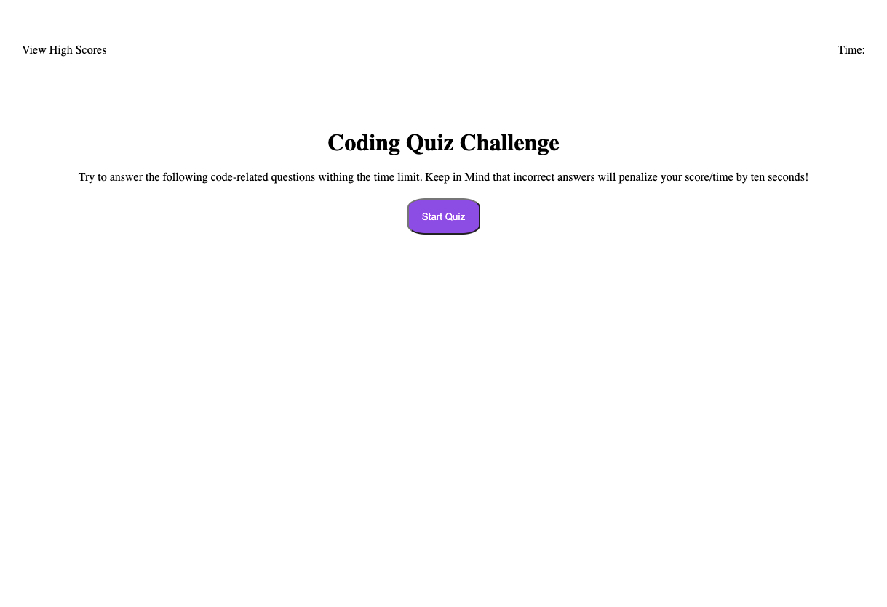

# Code Quiz

## Table of Contents

* [Description](#description)
* [Technologies](#technologies)
* [Setup](#setup)
* [Webpage Demo](#webpage-demo)

---

## Description

The purpose of this project is create a Javascript code quiz game to demonstrate my Javascript Skills ans Web API skills.

---

## Technologies

* HTML5
* CSS
* Javascript

---

## Setup

* To run this project clone the repository and open in your prefered code editor. Open index.html in your browser.
* Click the start quiz button and follow prompts and the application will generate a password.

---

## Webpage Demo

Link to webpage: [**Code Quiz**](https://jarydknight.github.io/code-quiz/)

.png)

.png)